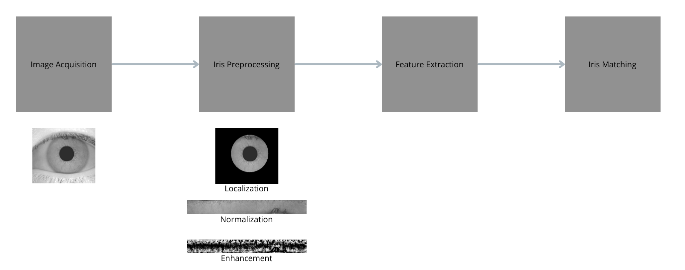
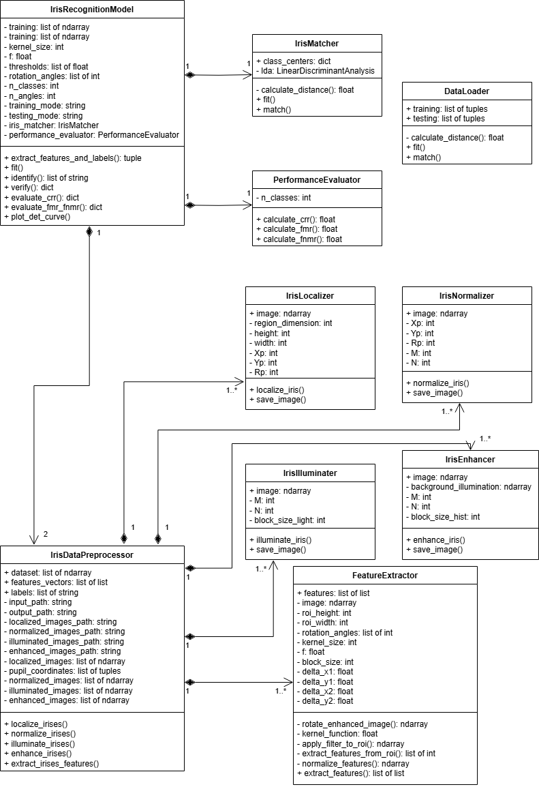

# IrisRecognition

<!-- TABLE OF CONTENTS -->
<details>
  <summary>Table of Contents</summary>
  <ol>
    <li>
      <a href="#overview">Overview</a>
      <ul>
        <li><a href="#requirements">Requirements</a></li>
        <li><a href="#how-to-get-started">How to Get Started</a></li>
      </ul>
    </li>
    <li>
      <a href="#project-structure">Project Structure</a>
      <ul>
        <li><a href="#1-iris-localization">1. Iris Localization</a></li>
        <li><a href="#2-iris-normalization">2. Iris Normalization</a></li>
        <li><a href="#3-image-enhancement">3. Image Enhancement</a></li>
        <li><a href="#4-feature-extraction">4. Feature Extraction</a></li>
        <li><a href="#5-iris-matching">5. Iris Matching</a></li>
        <li><a href="#6-performance-evaluation">6. Performance Evaluation</a></li>
        <li><a href="#7-iris-preprocessing">7. Iris Preprocessing</a></li>
        <li><a href="#8-iris-recognition-model">8. Iris Recognition Model</a></li>
      </ul>
    </li>
    <li>
      <a href="#usage">Usage</a>
      <ul>
        <li><a href="#1-data-loading">1. Data Loading</a></li>
        <li><a href="#2-pipeline-execution">2. Pipeline Execution</a></li>
        <li><a href="#3-model-training-and-evaluation">3. Model Training and Evaluation</a></li>
        <li><a href="#4-detection-error-trade-off-det-curve">4. Detection Error Trade-off (DET) Curve</a></li>
      </ul>
    </li>
    <li>
      <a href="#limitations--improvements">Limitations & Improvements</a>
    </li>
    <li>
      <a href="#resources">Resources</a>
    </li>
  </ol>
</details>

<!-- OVERVIEW -->
## Overview

This project implements an iris recognition system that extracts and analyzes iris features from images using various image processing and machine learning techniques. It follows the design presented by Ma et al. in their paper, "Personal Identification Based on Iris Texture Analysis" [1] (available in the appendix).



### Requirements

This project is built in Python and will require the user to install the following packages:
- numpy
- matplotlib
- opencv
- scikit-learn

It is possible to install these dependencies with the following command:
   ```sh
   py -m pip install -r requirements.txt
   ```

### How to get started

There is an example of usage in the main.py file in the src folder. It imports the package iris_recognition alongside the two available classes IrisRecognitionModel and DataLoader.

The config.json file should only be configured to modify the paths of the different used folders. The default and recommended usage is that the input dataset is located in its own folder on the same level as the iris_recognition package in the src folder.

## Project Structure

The following UML class diagram describes the general architecture of the code:



### 1. Iris Localization

**File:** iris_localization.py

**Objective:** Detect and isolate the iris from the eye image.

**Process:**

- Estimate the Pupil Center: Approximated the pupil coordinates by processing a small region around the center. 

- Refinement: Applied adaptive thresholding using Otsu's methods to refine the location of the pupil center using the centroid of the binary mask.

- Iris Boundary Detection: Used Canny edge detection and the Hough Circle Transform to detect circular iris boundaries.

### 2. Iris Normalization

**File:** iris_normalization.py

**Objective:** Normalize the localized iris into a rectangular image for consistent feature extraction.

**Process:** The iris region is unwrapped using polar coordinates by generates the radial and angular coordinates and grids of shape M x N (64 x 512), computing the inner and outer boundaries of the iris, and remapping the original image to the normalized coordinates, which results in a consistent rectangular iris image of size M x N (64 x 512).

### 3. Image Enhancement

**Files:** iris_illumination.py and iris_enhancement.py

**Objective:** Improve the quality of the normalized iris image by compensating for illumination and contrast issues to improved feature extraction. 

**Process:**

- IrisIlluminater: Estimate the background illumination of the iris by dividing the image into 16 x 16 blocks, calculate the mean value for each block, contruct a block matrix of mean values, and resize the block matrix to the original image size using bicubic interpolation. 

- IrisEnhancer: Enhance contrast by subtracting the background illumination from the normalized image, dividing the image into 32 x 32 blocks, and applying histogram equalization to blocks of the image.

### 4. Feature Extraction

**File:** feature_extraction.py

**Objective:** Handle feature extraction from iris images using custom Gabor filters and block-based feature extraction methods.

**Process:**

- Gabor Filters: Apply two custom Gabor filters (modulation function and Guassian envelope) to the iris' region of interest (ROI) - 48 x 512.

- Block-based Features: Divide the ROI into small blocks, and for each block, calculate the mean and average absolute deviation.

- Rotation: Extract features after rotating the image at multiple angles to handle angular misalignment. 

### 5. Iris Matching

**File:** iris_matching.py

**Objective:** Match input iris feature vectors to their respective classes using LDA and a nearest center classifier.

**Process:**

- LDA Projection: Project feature vectors into a lower-dimensional space.

- Nearest Center Classifier: Match the projected vector to the nearest class center in the reduced space using L1, L2, or Cosine distance. It supports both identification and verification modes used in biometrics.

### 6. Performance Evaluation

**File:** performance_evaluation.py

**Objective:** Evaluate model performance using metrics such as Correct Recognition Rate (CRR), False Match Rate (FMR), and False Non-Match Rate (FNMR).

**Metrics:**

- Correct Recognition Rate (CRR): The percentage of correctly recognized irises (identification mode)

- False Match Rate (FMR): The percentage of impostor matches incorrectly classified as genuine matches (verification mode).

- False Non-Match Rate (FNMR): The percentage of genuine matches incorrectly classified as non-matches (verification mode).

### 7. Iris Preprocessing

**File:** iris_preprocessing.py

**Objective:** Create the core pipeline that integrates the localization, normalization, enhancement, feature extraction, and matching modules to recognize irises.

**Process:**

- For each image from the dataset, it performs the preprocessing and feature extraction parts

- The final goal is to extract both features and labels

### 8. Iris Recognition Model

**File:** iris_recognition.py

**Objective:** Create the main machine learning model to recognize an iris

**Process:**

- Currently supports both identification and verification mode used in biometrics
  
- The computed distance are the ones mentionned in [1] (e.g. L1, L2 and Cosine)

- Only calculates the CRR (accuracy) and the FMR/FNMR for the cosine distance

## Usage

### 1. Data Loading
The dataset is loaded using the DataLoader class. It expects a folder structure where each eye's images are stored in subdirectories for training and testing:

input/

    └── 001/
    
        ├── 1/
        
        └── 2/
        
The load() method loads the images and splits them into training and testing sets.

### 2. Pipeline Execution

The core recognition process is handled by the IrisDataPreprocessor class, which performs:

- Localization

- Normalization

- Illumination Correction

- Enhancement

- Feature Extraction

The features extracted from the images are used for identification and verification.

### 3. Model Training and Evaluation

The IrisRecognitionModel class provides functions to:

- Train the model using the extracted features.

- Identify iris classes based on a similarity metric (L1, L2, Cosine).

- Verify whether a test image belongs to a claimed class using a threshold-based approach.

After model training and testing, performance metrics are computed using the PerformanceEvaluator.

### 4. Detection Error Trade-off (DET) Curve

The DET Curve is used to visualize the trade-off between FMR and FNMR. The function `plot_det_curve` plots this curve to evaluate how different thresholds affect the model's performance. 

## Limitations & Improvements

1. Sensitivity to Lighting Conditions: The current image enhancement approach uses basic illumination correction and histogram equalization. It may still struggle with images taken under significantly varying lighting conditions or with non-uniform brightness across the iris.  we could improve by implementing more advanced illumination correction or even deep learning-based enhancement techniques to handle more diverse lighting conditions.
   
2. Fixed Parameters: Parameters such as the Gabor filter settings, block sizes, and kernel sizes are fixed in the feature extraction process. These may not generalize well across different datasets or capture enough discriminative features under diverse conditions (e.g., noisy images, blurred irises). To combat this, we could introduce an automatic parameter tuning mechanism (e.g., grid search or cross-validation) to optimize parameters like Gabor filter settings, block sizes, and thresholds for each dataset.

3. Manual Threshold Selection: The thresholds for FMR and FNMR are manually tuned. This is not ideal for real-world applications, where automatic threshold optimization based on data-driven techniques would be more robust. We could replace the fixed thresholding approach with more advanced techniques, such as ROC curve-based threshold optimization or using a machine learning model to determine thresholds dynamically based on the dataset.

4. Limited Rotation Handling : The system handles rotation by rotating images at a few fixed angles. This approach might miss certain cases where the rotation exceeds the predefined set of angles, leading to poor recognition performance in such instances. We could explore techniques to improve the system's ability to handle extreme rotation.

5. Noise Reduction: Eyelashes and other obstacles may lower the model's performance and should be treated during preprocessing. We could implement eyelash masking to identify eye regions with heavy obstruction and mask them before feature extraction.

In general, we should introduce data augmentation techniques (e.g., random rotations, blurring, brightness adjustments) to make the model more resilient to variations in the iris images and improve generalization to new data.

## Resources 

[1] L. Ma, Y. Wang, and T. Tan, "Personal Identification Based on Iris Texture Analysis," IEEE Transactions on Pattern Analysis and Machine Intelligence, vol. 25, no. 12, pp. 1519-1533, Dec. 2003.


